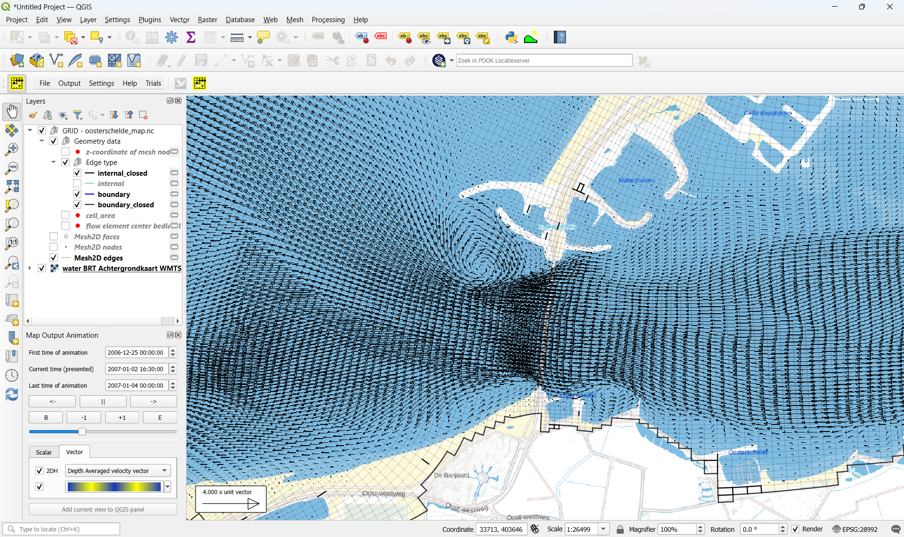

# QGIS SGRID/UGRID
QGIS plugin to plot 1D, 1D2D and 2D time series map results as animation. The map results should be stored on a netCDF file according the SGRID (no padding) or UGRID standard. It support 1D grid, 1D2D contact grids and/or 2D grids. 3D grids can be displayed by sigma- or z-layer, no combination is yet supported. All types could be in one netCDF file. 

<<<<<<< HEAD
Animation:
[▶️ View animation](media/sgrid_ugrid_oosterschelde.mp4)

=======
>>>>>>> parent of 91b7211 (A short animation in QGIS 4.2.2 of the capabilities of the qgis_sgrid_ugrid plugin)
## To build
To build the SGRID_UGRID plugin you have to install QGIS (OSGeo4W network installer (64 bit), https://qgis.org/en/site/forusers/download.html ).
The windows solution and/or the CMake environment will place the sgrid_ugrid.dll on the qgis plugin directory (ex. c:\OSGeo4W64\apps\qgis\plugins\sgrid_ugrid.dll).

## Development environment
At this moment the development environment is based on Visual Studio 2022.
 
## Environment variables
Environment variables (example)
QT6DIR_OSGEO=c:\OSGeo4W\apps\Qt6
BOOST_ROOT_DIR=c:\boost\boost_1_90_0
NETCDF_DIR=c:\Program Files\netCDF 4.9.2              

## Installing QGIS from OSGeo4W
Installing QGIS from OSGeo4W network installer (64 bit)
After a few screens.
Selectpackages to install.
Desktop:
    qgis: QGIS Desktop
    qgis-full: QGIS Full Desktop (meta package for express install)
Libs: 
    QGIS-devel: QGIS development files
    qt6-libs: Qt5 runtime libraries
    qt6-libs-debug
    qt6-libs-debug-pdb
    qt6-libs-pdb
    qt6-devel; qt5 headers and libraries (Development)
            
##Note (QGIS 3.44.0 and higher)
When compiling the source code I had to adjusted the file qgsdistancearea.h.
An extra define of M_PI_2 is added at about line 215
#ifndef M_PI_2
#define M_PI_2 1.57079632679489661923
#endif

and file qgsabstractgeometry.h
About line 574
#ifndef M_PI
#define M_PI 3.14159265358979323846264338327950288
#endif

and also file qgsvector.h:
About line 172
#ifndef M_PI
#define M_PI 3.14159265358979323846264338327950288
#endif

end document
